# StS-DuelistMod
A Slay the Spire adaptation of Yu-Gi-Oh!

Discord Server: https://discord.gg/Tcwws6U

## REQUIREMENTS
- Basemod
- StSLib

## CROSSOVER CONTENT FOR
- Googly Eyes
- Challenge the Spire

# Introduction
The Duelist mod adds a new playable character, Yugi Moto. Yugi has an expansive set of 1400+ new cards, all adapted from real Yu-Gi-Oh! cards. This mod also adds 30+ new relics and 25+ new potions. None of the content added with this mod should affect the base game, and none of the relics or potions are added to the shared pool (i.e. they are only obtainable when playing as The Duelist), with the sole exception of the Millennium Puzzle, which may show up in the shop for all other characters.   

This is a work in progress, and there will likely be some bugs and minor issues. I will do my best to address any unforeseen problems that arise, and of course I will be doing my own continued playtesting and debugging. Expect periodic updates. My contact information is listed at the end of this description if you would like to reach me directly with issues/feedback/bug reports/suggestions/hate mail. Thanks for playing!

# Duelist Keywords
Summon - Counts monsters currently summoned. Maximum of 5 Summons.  
Tribute - Removes X Summons. Unless you have enough Summons to Tribute, you cannot play a Tribute monster.  
Resummon - Replays the card, ignoring Tribute costs. Some monsters trigger extra special effects when Resummoned.  
Increment - Increase your maximum Summons by X.  
Randomized - Randomized cards may have their costs changed, may Exhaust, and may become Upgraded or Ethereal.

# Gameplay Mechanics
## Summoning & Tributing
When you play lower cost/power monsters with the Summon keyword, you gain stacks of summons equal to the number found on the card, up to a certain maximum number. The default maximum is 5, but this number	can be increased via card effect. Having a lot of summons allows you to play more powerful monster cards with the Tribute keyword. To play a card with the Tribute keyword, you will need to have at least as many summons as the number found on the card. For example, in the starting deck you find the monster cards 7-Colored Fish, which has the text 'Summon 1', and Summoned Skull, which has the text 'Tribute 1'. In this example, if you have 0 summons, you would need to play 7-Colored Fish first to stack up 1 summon, and then you would be able to play Summoned Skull which would consume that 1 stack you just created with 7-Colored Fish, leaving you again with 0 summons. 

Additionally, summoning monsters succesfully adds those monsters to your currently summoned monster list. This list is found by hovering over the summon power icon below your health bar. You will find at the end of the power tooltip a list of all monsters you still currently have available to tribute. This can be helpful because many cards trigger special effects by tributing the right kind of monster, or in some cases, you want to avoid tributing some monsters. Generally, the text of the summoned monsters list is colored to aid you a bit. Monster names will be colored either White, Blue, Purple or Red. White is neutral - any monster with no Tribute effect will be colored white. Purple is associated with Tokens. Blue colored monsters are associated with some sort of positive tribute effect. Red colored monsters are associated with negative tribute effects. 

For example, you may come across the card Mystical Elf. This card has the 'Spellcaster' keyword, which indicates that tributing it for any monster with the 'Dragon' keyword will cause you to lose 2 HP. So when you play Mystical Elf, there will be one entry in your summoned monster list that is red and says Mystical Elf. If you play a Tribute card with the 'Dragon' keyword and Mystical Elf is removed from your list, then you will lose 2 HP. To prevent this from happening, you could either: summon more monsters after Mystical Elf and use those to Tribute for your Dragon card, or simply tribute Mystical Elf with a non-Dragon Tribute card before playing the Dragon. Tribute cards always pull from the end of the list first (most recently summoned monsters).
	
## Resummon
There is a similar keyword called 'Resummon' that allows you to replay monster cards for 0 energy. When you Resummon a monster, that monster will trigger all effects triggered when originally playing the card, except that Tribute monsters will not consume any summons and are played completely for free. To be clear, monsters with the 'Summon' keyword WILL summon additional monsters when resummoned, but monsters with the 'Tribute' keyword WILL NOT tribute when resummoned. All other card effects (damage, block, channel orbs, etc.) should trigger normally. Untargeted resummon effects that pull targeted monster cards will target random enemies.
	
## Increment
The 'Increment' keyword signifies that your maximum number of summons will increase (for combat) by the number found on the card. For example, Kuriboh has the text 'Increment 1'. When you play Kuriboh, you will be able to summon 6 monsters at one time without tributing any first, instead of the usual of 5. Increments certainly stack, so if you play multiple copies of Kuriboh in the same battle, you can raise your max summons even further. There is no limit to how high your maximum summons can be.
	
## Monster, Spell, Trap, Tokens
All Duelist cards are of type Monster, Spell, Trap or Token. This change is somewhat cosmetic only - and by that I mean that every card is also either an Attack, Skill or Power. The new card types used by this mod are for thematic flavor and gameplay reasons only. For example, some cards will specifically trigger effects regarding Monster cards. You should look at the type listed on the card in this situation. Conversely, some enemies may trigger effects when you play non-Attack cards. You should look at the picture shape of the card in this situation, as any card that is technically an Attack will still have the diagonally-cut squarish shape found on Attack cards in the base game. Duelist cards that are technically Skills will still have rectangular shaped card images, Powers will still be circular, you get the idea. The base game types (Attack, Skill, Power) and Duelist types (Monster, Trap, Spell) are not associated in any way. For example, there are Attack Monsters, Skill Monsters, Power Monsters, Attack Spells, Skill Spells, Power Traps, etc. Tokens are not cards that will ever be played, and exist only as a way to trigger certain effects, or generally, simply as a generic summon to tribute from your summons list.
	
## Custom Orbs
There are 24 custom orbs added with this mod. I don't believe it will be possible to channel these orbs outside of using the Duelist character though. Some may be channeled directly via card effect, others may only be channeled indirectly via random effects.

## Random Actions (Time Wizard & Glitch orb)
This card and this orb are the only ways to currently trigger a 'random action'. The list of actions for both is similar. The full list of actions as they appear in the array for each card is given below.

## Tokens
There are many different types of Token cards that are used for various summoning and temporary effects. You can find these cards in the Compendium under the 'DUELIST' color tab. 

## Challenge Mode
Can be unlocked for each starting deck by defeating the Heart at Ascension 20. Challenge Mode works similar to Ascension, as each additional level of Challenge Mode will stack the difficulty modifiers until you reach Challenge Mode 20. You can play Challenge Mode with or without Ascension mode being enabled. Each additional Challenge level is unlocked by defeating the Heart at the highest Challenge level available.

# Mod Options
## Getting to Mod Options
From the main menu: Mods -> Duelist Mod -> Config. The config button is on the bottom left, near the return to main menu button

## Remove all Toon/Ojama/Exodia cards
This option will remove all Toon/Ojama/Exodia cards from your card reward and shop pools. Selecting this option during a run will reset your card pool, which may change which random archetype cards are in your pool.

## Unlock All Decks
Allows you to select any starting deck at the character select screen. Your score is still tracked in the background. All the decks are always unlocked for custom runs.

## Flip Tags
This option, when selected, will change cards to instead be tagged as Attack/Skill/Power. Turning the option off will re-enable Monster/Spell/Trap tags on the cards. Card colors are never altered. 

# Creator Information
Thanks for playing the Duelist! Please let me know if you have any feedback or bug reports! 

Email: nyoxidestsmods@gmail.com

Discord: Nyoxide#3464

## Screenshots
Some in game screenshots taken of the first steam release build (3-6-19). Everything is absolutely always subject to change.

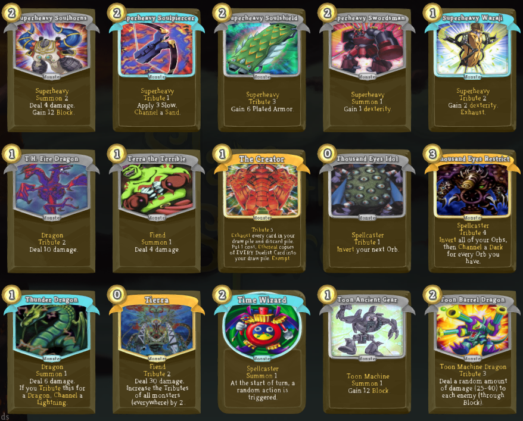
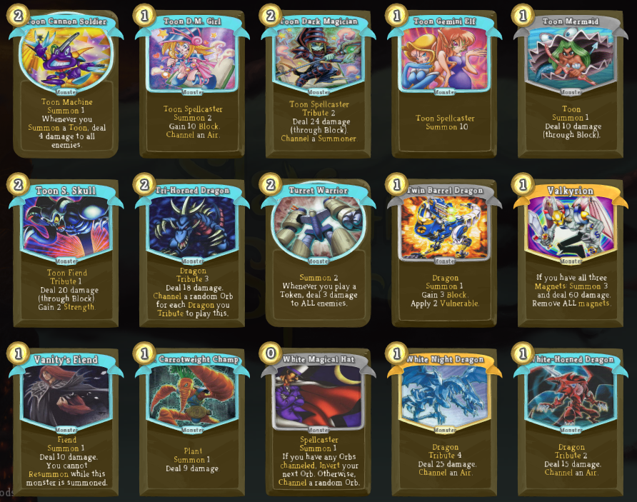
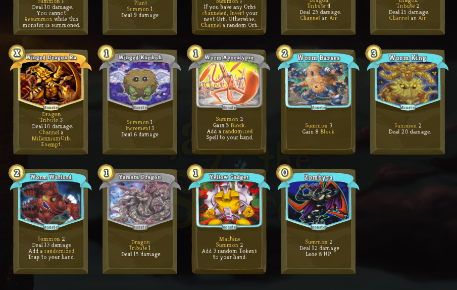
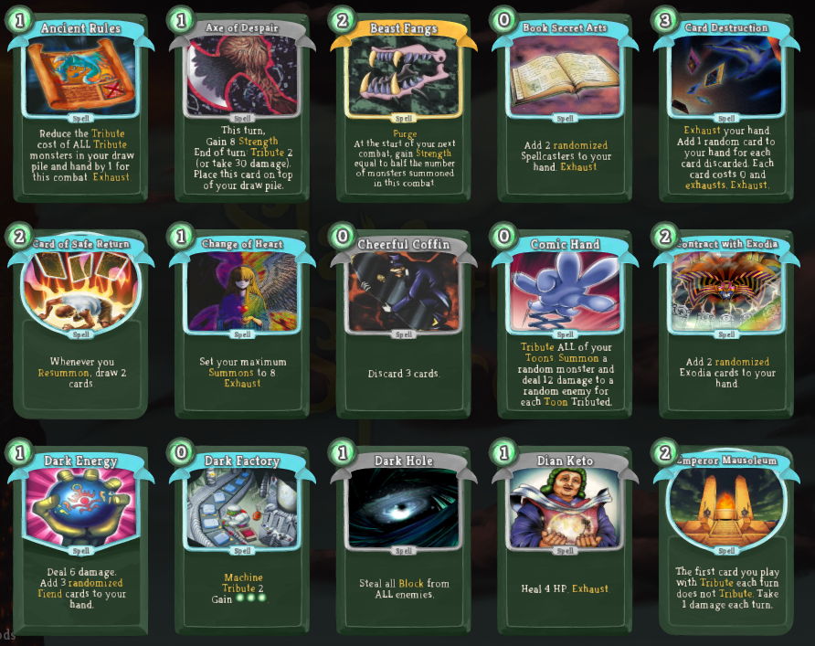
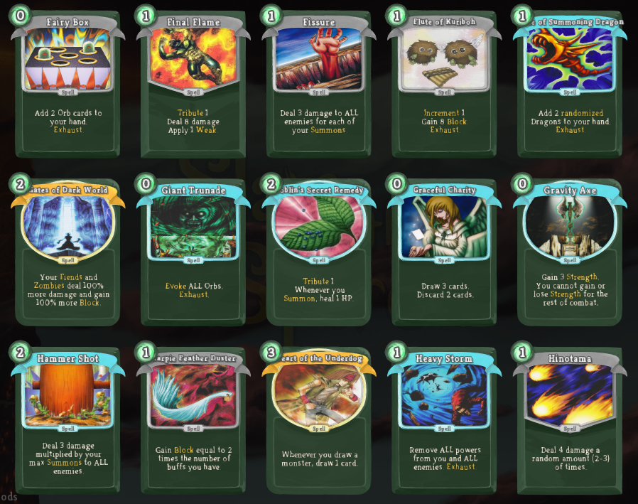
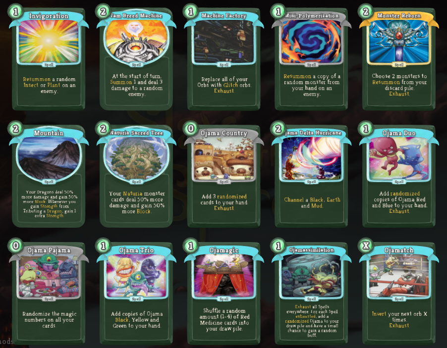
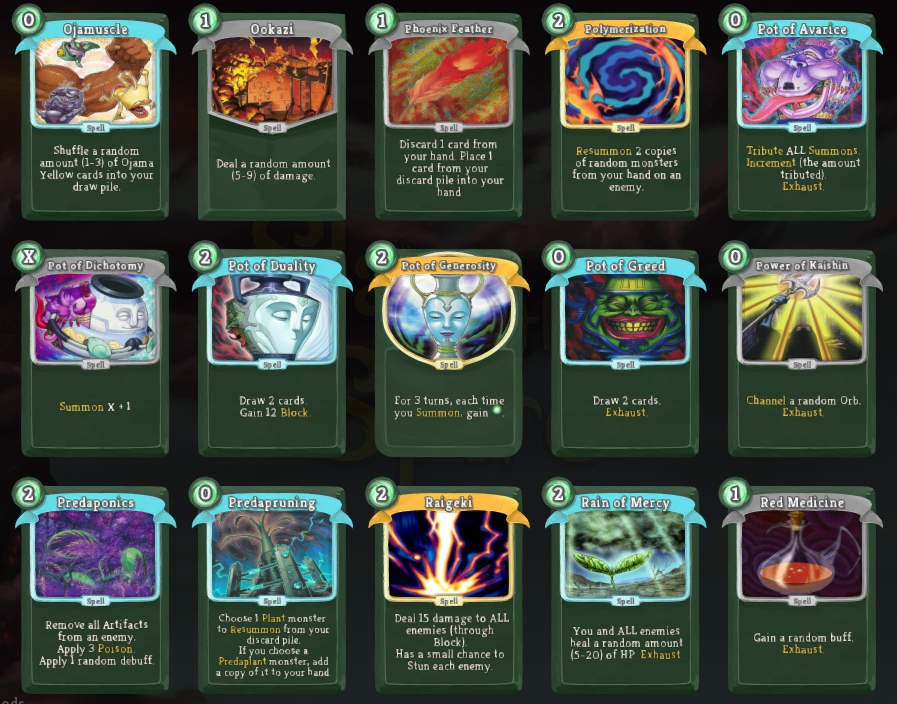
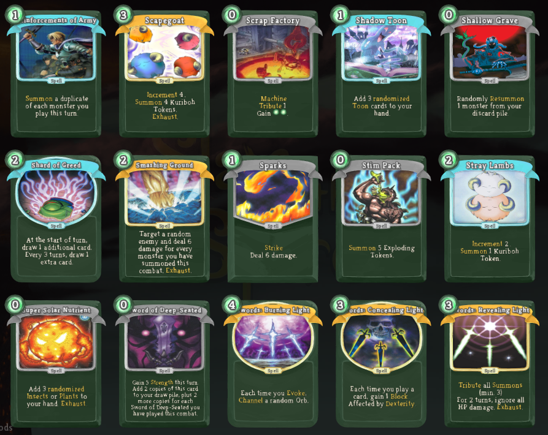
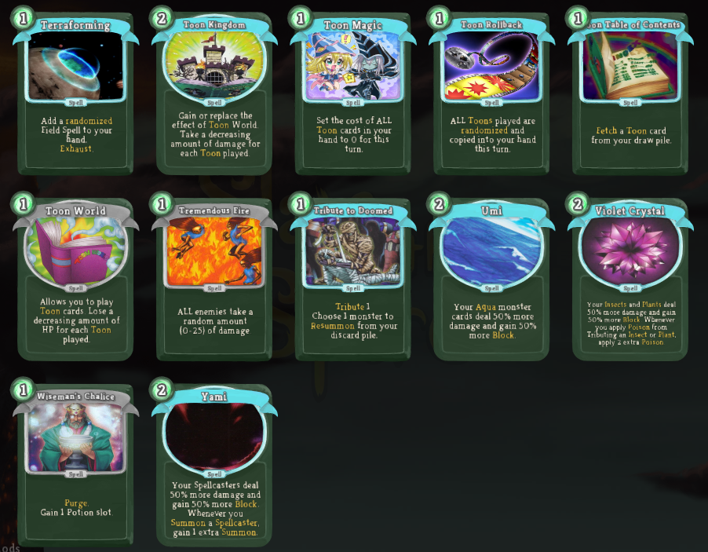
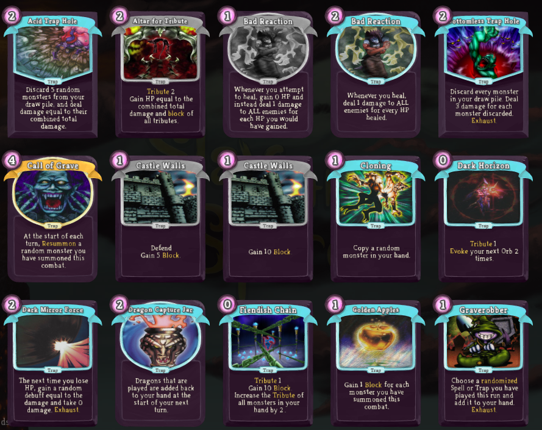
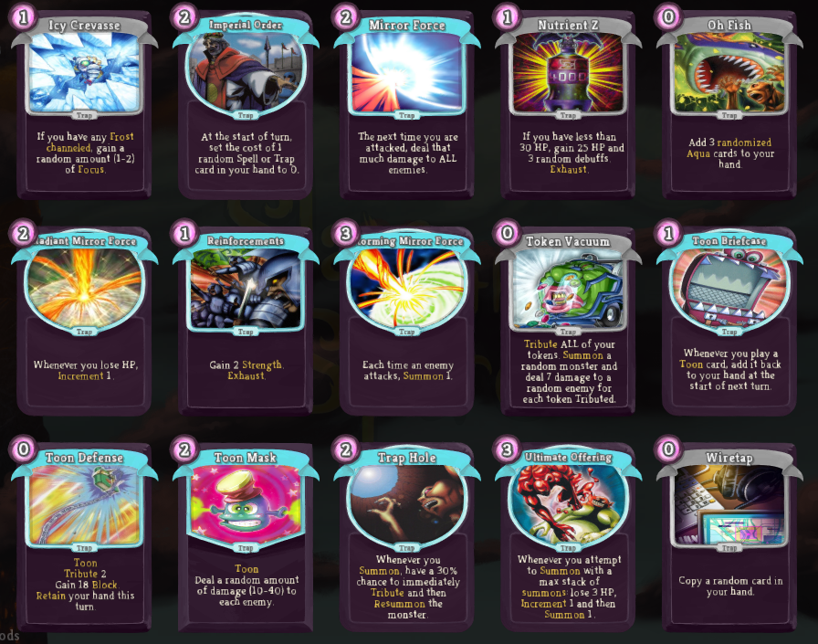
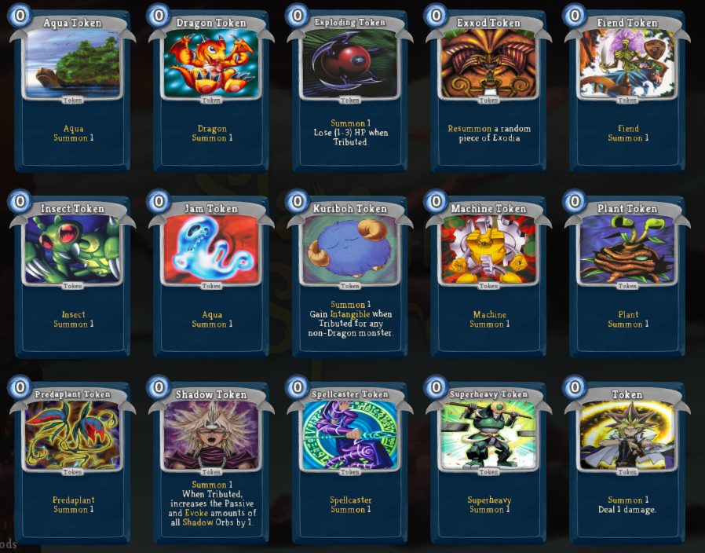
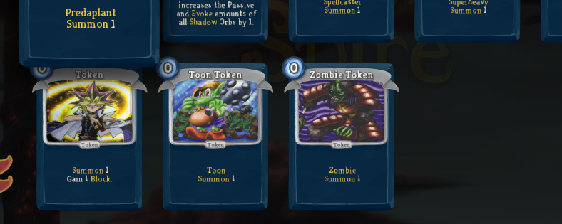
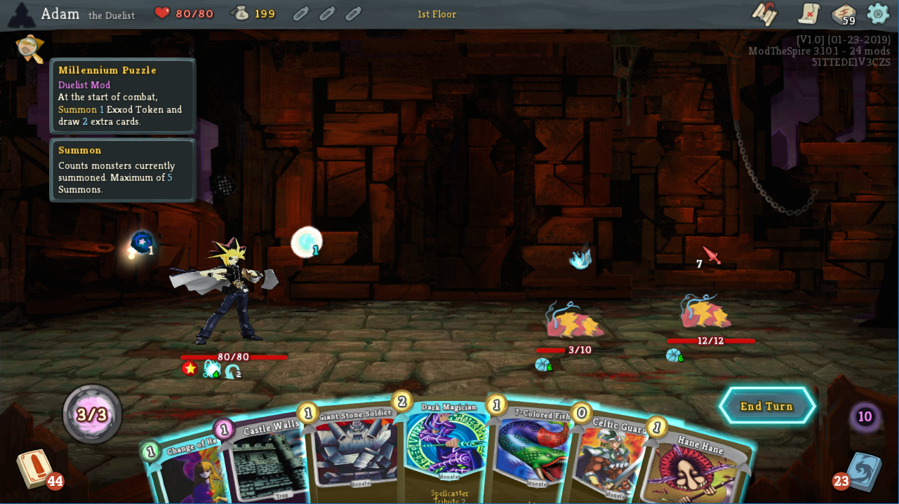

