# StS-DuelistMod
A Slay the Spire adaptation of Yu-Gi-Oh!

## REQUIREMENTS
- Basemod
- StSLib

## CROSSOVER CONTENT FOR
- Replay the Spire
- Conspire
- Googly Eyes

# Introduction
The Duelist mod adds a new playable character, Yugi Moto. Yugi has an expansive set of 200+ new cards, all adapted from real Yu-Gi-Oh! cards. This mod also adds 8 new relics and 3 new potions. None of the content added with this mod should affect the base game, and none of the relics or potions are added to the shared pool (i.e. they are only obtainable when playing as The Duelist).

This is a work in progress, and there will likely be some bugs and minor issues. I will do my best to address any unforeseen problems that arise, and of course I will be doing my own continued playtesting and debugging. Expect periodic updates. My contact information is listed at the end of this description if you would like to reach me directly with issues/feedback/bug reports/suggestions/hate mail. Thanks for playing!

# Gameplay Mechanics
## Summoning & Tributing
When you play lower cost/power monsters with the Summon keyword, you gain stacks of summons equal to the number found on the card, up to a certain maximum number. The default maximum is 5, but this number	can be increased via card effect. Having a lot of summons allows you to play more powerful monster cards with the Tribute keyword. To play a card with the Tribute keyword, you will need to have at least as many summons as the number found on the card. For example, in the starting deck you find the monster cards 7-Colored Fish, which has the text 'Summon 1', and Summoned Skull, which has the text 'Tribute 1'. In this example, if you have 0 summons, you would need to play 7-Colored Fish first to stack up 1 summon, and then you would be able to play Summoned Skull which would consume that 1 stack you just created with 7-Colored Fish, leaving you again with 0 summons. 

Additionally, summoning monsters succesfully adds those monsters to your currently summoned monster list. This list is found by hovering over the summon power icon below your health bar. You will find at the end of the power tooltip a list of all monsters you still currently have available to tribute. This can be helpful because many cards trigger special effects by tributing the right kind of monster, or in some cases, you want to avoid tributing some monsters. Generally, the text of the summoned monsters list is colored to aid you a bit. Monster names will be colored either White, Blue, Purple or Red. White is neutral - any monster with no Tribute effect will be colored white. Purple is associated with Tokens. Blue colored monsters are associated with some sort of positive tribute effect. Red colored monsters are associated with negative tribute effects. 

For example, you may come across the card Mystical Elf. This card has the 'Spellcaster' keyword, which indicates that tributing it for any monster with the 'Dragon' keyword will cause you to lose 2 HP. So when you play Mystical Elf, there will be one entry in your summoned monster list that is red and says Mystical Elf. If you play a Tribute card with the 'Dragon' keyword and Mystical Elf is removed from your list, then you will lose 2 HP. To prevent this from happening, you could either: summon more monsters after Mystical Elf and use those to Tribute for your Dragon card, or simply tribute Mystical Elf with a non-Dragon Tribute card before playing the Dragon. Tribute cards always pull from the end of the list first (most recently summoned monsters).
	
## Resummon
There is a similar keyword called 'Resummon' that allows you to replay monster cards for 0 energy. When you Resummon a monster, that monster will trigger all effects triggered when originally playing the card, except that Tribute monsters will not consume any summons and are played completely for free. To be clear, monsters with the 'Summon' keyword WILL summon additional monsters when resummoned, but monsters with the 'Tribute' keyword WILL NOT tribute when resummoned. All other card effects (damage, block, channel orbs, etc.) should trigger normally. Untargeted resummon effects that pull targeted monster cards will target random enemies.
	
## Increment
The 'Increment' keyword signifies that your maximum number of summons will increase (for combat) by the number found on the card. For example, Kuriboh has the text 'Increment 1'. When you play Kuriboh, you will be able to summon 6 monsters at one time without tributing any first, instead of the usual of 5. Increments certainly stack, so if you play multiple copies of Kuriboh in the same battle, you can raise your max summons even further. There is no limit to how high your maximum summons can be.
	
## Monster, Spell, and Trap Cards
All Duelist cards are of type Monster, Spell or Trap. This change is somewhat cosmetic only - and by that I mean that every card is also either an Attack, Skill or Power. The new card types used by this mod are for thematic flavor and gameplay reasons only. For example, some cards will specifically trigger effects regarding Monster cards. You should look at the type listed on the card in this situation. Conversely, some enemies may trigger effects when you play non-Attack cards. You should look at the picture shape of the card in this situation, as any card that is technically an Attack will still have the diagonally-cut squarish shape found on Attack cards in the base game. Duelist cards that are technically Skills will still have rectangular shaped card images, Powers will still be circular, you get the idea. The base game types (Attack, Skill, Power) and Duelist types (Monster, Trap, Spell) are not associated in any way. For example, there are Attack Monsters, Skill Monsters, Power Monsters, Attack Spells, Skill Spells, Power Traps, etc.
	
## Custom Orbs
There are 12 custom orbs added with this mod. I don't believe it will be possible to channel these orbs outside of using the Duelist character though. These orbs are: Air, Buffer, DragonOrb, Earth, Fire, Gate, Glitch, MonsterOrb, Reducer, Shadow, Splash, and Summoner. Some may be channeled directly via card effect, others may only be channeled indirectly via random effects.

# Mod Options
## Remove all Toon cards
This option will remove the 14 Toon cards from the game. Toggle the box to your desired preference and then restart the game. Checking this option and then using the Toon deck may lead to undefined behavior.

## Remove all Exodia cards
This option will remove the 6 Exodia cards from the game. Functions the same as the 'Remove all Toons' option.

## Allow mod crossover cards
There are 14 bonus cards that can be added to the game if you have this option checked and you load the game with both Replay the Spire and Conspire.

## Starting Deck
This option lets you choose which deck you would like to use for your runs. I have defined 6 starting decks for now, and there are also 2 additional options for using a randomly-generated deck. Select the deck you would like and start a fresh run to try it out!

## Set Size
You can change this option to remove large groups of the cards from the game. There are 5 different card sets to select from: Core, Limited, Reduced, Full and All. The Core set is the smallest, with only 61 cards, while the All set is the largest set with 186 cards. If you have both 'Remove cards' mod options turned off, the 'Allow crossover cards' option turned on, and the card set size set to 'All', then the game will have the maximum number of possible cards at 200. The number of cards currently turned on is always displayed in the options panel after the 'Active Duelist Cards:' label. This setting is largely untested, so there may be some bugs when using sets other than 'All'.

# Known Issues
- Downgrading cards does not work properly when cards that have Tribute-based upgrades become Downgraded. However in most cases, this is beneficial and it should never crash the game or cause any other major side effects.

# To Do (ordered by priority)
- Add a few more starting decks
- Add more random-generation-only cards
- Add additional Relics and Potions
- Translations (Chinese at least, maybe Russian)
- Add event(s)
- Add enemies

# Creator Information
Thanks for playing the Duelist! Please let me know if you have any feedback or bug reports! 

Email: nyoxidestsmods@gmail.com

Discord: Nyoxide#3464

# Card List

Castle Walls - *Core*  
Giant Stone Soldier - *Core*  
Ookazi - *Core*  
Scrap Factory - *Core*  
7-Colored Fish - *Core*  
Summoned Skull - *Core*  
Armored Zombie - *Core*  
Axe of Despair - *Core*  
Baby Dragon - *Core*  
Tremendous Fire - *Core*  
Blizzard Dragon - *Core*  
B.E. White Dragon - *Core*  
B. Eyes Ultimate - *Core*  
Buster Blader - *Core*  
Cannon Soldier - *Core*  
Card Destruction - *Core*  
Castle Dark Illusion - *Core*  
Catapult Turtle - *Core*  
Cave Dragon - *Core*  
Celtic Guardian - *Core*  
Change of Heart - *Core*  
Dark Magician - *Core*  
Darklord Marie - *Core*  
Dian Keto - *Core*  
Dragon Capture Jar - *Core*  
Fiend Megacyber - *Core*  
Fissure - *Core*  
Flute of Summoning Dragon - *Core*  
Fortress Warrior - *Core*  
G. Dragon Champion - *Core*  
G. Fierce Knight - *Core*  
Gemini Elf - *Core*  
Graceful Charity - *Core*  
Gravity Axe - *Core*  
Hane Hane - *Core*  
Hinotoma - *Core*  
Imperial Order - *Core*  
Injection Fairy Lily - *Core*  
Insect Queen - *Core*  
Island Turtle - *Core*  
Jam Breed Machine - *Core*  
Judge Man - *Core*  
Kuriboh - *Core*  
Labyrinth Wall - *Core*  
Lesser Dragon - *Core*  
Lord of D. - *Core*  
Mirror Force - *Core*  
Monster Reborn - *Core*  
Mountain - *Core*  
Mystical Elf - *Core*  
Obelisk - *Core*  
Pot of Generosity - *Core*  
Pot of Greed - *Core*  
Prevent Rat - *Core*  
Pumpking - *Core*  
Raigeki - *Core*  
Rain of Mercy - *Core*  
R. Eyes Black Dragon - *Core*  
Relinquished - *Core*  
Kazejin - *Core*  
Sanga of Thunder - *Core*  
Scapegoat - *Core*  
Slifer Sky Dragon - *Core*  
Mini L. Wall - *Core*  
Snow Dragon - *Core*  
Snowdust Dragon - *Core*  
Spirit of the Harp - *Core*  
Superheavy Benkei - *Core*  
Superheavy Scales - *Core*  
Superheavy Swordsman - *Core*  
Superheavy Waraji - *Core*  
Thunder Dragon - *Core*  
Winged Dragon Ra - *Core*  
Yami - *Core*  
A. Magnet Warrior - *Limited*  
Ancient Rules - *Limited*  
Bad Reaction - *Limited*  
B. Magnet Warrior - *Limited*  
Dark Hole - *Limited*  
D.M. Girl - *Limited*  
Exodia Head - *Limited*  
Exodia L. Arm - *Limited*  
Exodia L. Leg - *Limited*  
Exodia R. Arm - *Limited*  
Exodia R. Leg - *Limited*  
Phoenix Feather - *Limited*  
G. Magnet Warrior - *Limited*  
Emperor Mausoleum - *Limited*  
Millennium Shield - *Limited*  
Valkyrion - *Limited*  
Curse of Dragon - *Reduced*  
Cyber Dragon - *Reduced*  
Dark Factory - *Reduced*  
Fiend Skull Dragon - *Reduced*  
Five Headed Dragon - *Reduced*  
Giant Trunade - *Reduced*  
Harpie Feather Duster - *Reduced*  
Molten Zombie - *Reduced*  
Ojama Green - *Reduced*  
Ojama Yellow - *Reduced*  
Ojamagic - *Reduced*  
Ojamuscle - *Reduced*  
Pot of Avarice - *Reduced*  
Pot of Dichotomy - *Reduced*  
Pot of Duality - *Reduced*  
Pumprincess - *Reduced*  
R. Eyes Zombie Dragon - *Reduced*  
Red Medicine - *Reduced*  
Shard of Greed - *Reduced*  
Storming Mirror Force - *Reduced*  
Superheavy Brawler - *Reduced*  
Superheavy Daihachi - *Reduced*  
Superheavy Flutist - *Reduced*  
Superheavy General - *Reduced*  
Superheavy Magnet - *Reduced*  
Superheavy Ogre - *Reduced*  
Swords: Burning Light - *Reduced*  
Swords: Concealing Light - *Reduced*  
Swords: Revealing Light - *Full*  
Time Wizard - *Full*  
Trap Hole - *Full*  
B.E. Toon Dragon - *Full*  
Dragon Master Knight - *Full*  
Gandora - *Full*  
L. Exodia Incarnate - *Full*  
Radiant Mirror Force - *Full*  
Red Eyes Toon - *Full*  
Superancient Dinobeast - *Full*  
Token Vacuum - *Full*  
Toon Barrel Dragon - *Full*  
Toon Briefcase - *Full*  
Toon Dark Magician - *Full*  
Toon Gemini Elf - *Full*  
Toon Magic - *Full*  
Toon Mask - *Full*  
Toon Mermaid - *Full*  
Toon Rollback - *Full*  
Toon S. Skull - *Full*  
Toon World - *Full*  
Toon Kingdom - *Full*  
Toon D.M. Girl - *Full*  
Machine King - *All*  
Book Secret Arts - *All*  
Heavy Storm - *All*  
Fog King - *All*  
Lajinn Mystical Genie - *All*  
King Yamimakai - *All*  
Blackland Fire Dragon - *All*  
White Night Dragon - *All*  
White-Horned Dragon - *All*  
Revival Jam - *All*  
Stim Pack - *All*  
Bottomless Trap Hole - *All*  
Sword of Deep-Seated - *All*  
Monster Egg - *All*  
Steam Train King - *All*  
Machine Factory - *All*  
Tribute to Doomed - *All*  
Petit Moth - *All*  
Cocoon of Evolution - *All*  
Cheerful Coffin - *All*  
The Creator - *All*  
Polymerization - *All*  
Violet Crystal - *All*  
Predaponics - *All*  
Metal Dragon - *All*  
Super Solar Nutrient - *All*  
Gigaplant - *All*  
Basic Insect - *All*  
B. Skull Dragon - *All*  
Darkfire Dragon - *All*  
Empress Mantis - *All*  
Grasschopper - *All*  
Jinzo - *All*  
Levia-Dragon - *All*  
Man-Eater Bug - *All*  
Ocean Dragon Lord - *All*  
P. Chimerafflesia - *All*  
P. Chlamydosundew - *All*  
P. Drosophyllum - *All*  
P. Flytrap - *All*  
P. Pterapenthes - *All*  
P. Sarraceniant - *All*  
P. Spinodionaea - *All*  
Predapruning - *All*  
Tri-Horned Dragon - *All*  
Wiretap - *All*  
Gate Guardian - *Crossover*  
Legendary Fisherman - *Crossover*  
Suijin - *Crossover*  
Barrel Dragon - *Crossover*  
Blast Juggler - *Crossover*  
Dark Mirror Force - *Crossover*  
Flame Swordsman - *Crossover*  
Magic Cylinder - *Crossover*  
Nutrient Z - *Crossover*  
Ojama Black - *Crossover*  
Ojama King - *Crossover*  
Ojama Knight - *Crossover*  
Parasite Paracide - *Crossover*  
Wiseman's Chalice - *Random generation only*  
  
B.E. Toon Dragon - *Toons*  
Red Eyes Toon - *Toons*  
Toon Barrel Dragon - *Toons*  
Toon Briefcase - *Toons*  
Toon Dark Magician - *Toons*  
Toon Gemini Elf - *Toons*  
Toon Magic - *Toons*  
Toon Mask - *Toons*  
Toon Mermaid - *Toons*  
Toon Rollback - *Toons*  
Toon S. Skull - *Toons*  
Toon World - *Toons*  
Toon Kingdom - *Toons*  
Toon D.M. Girl - *Toons*  
L. Exodia Incarnate - *Exodia*  
Exodia Head - *Exodia*  
Exodia L. Arm - *Exodia*  
Exodia L. Leg - *Exodia*  
Exodia R. Arm - *Exodia*  
Exodia R. Leg - *Exodia*  

## Screenshots
Some in game screenshots taken of the first steam release build (3-6-19). Everything is absolutely always subject to change.

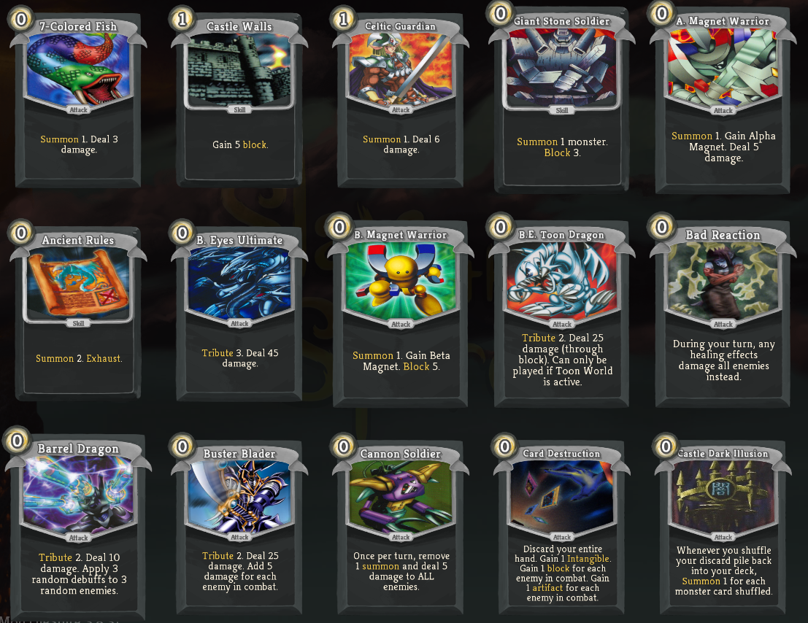
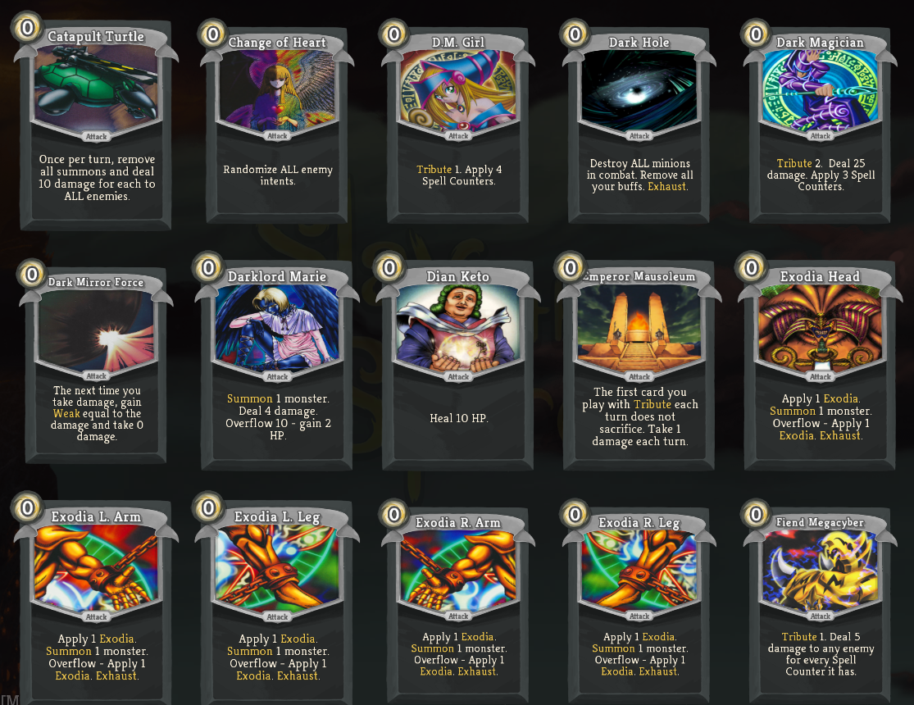
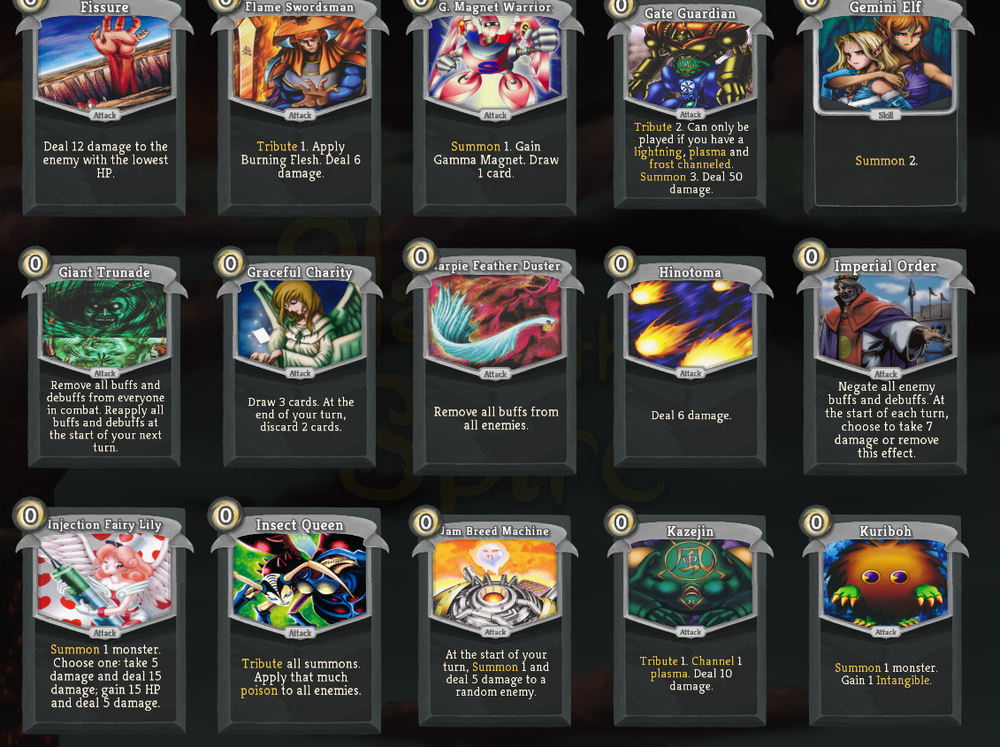
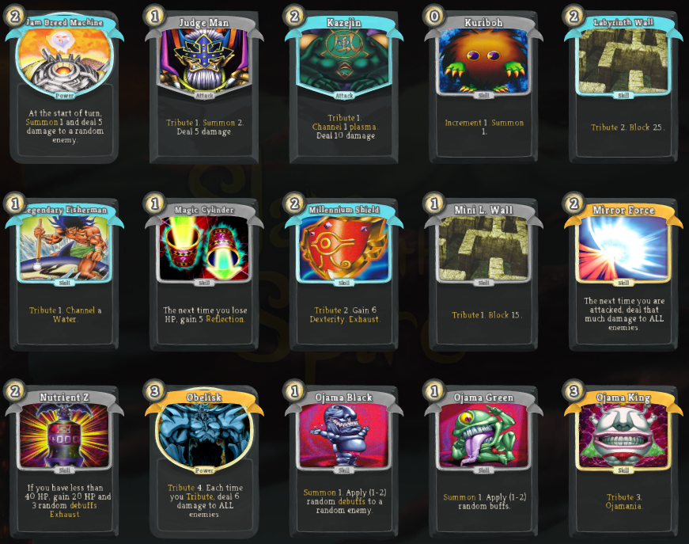
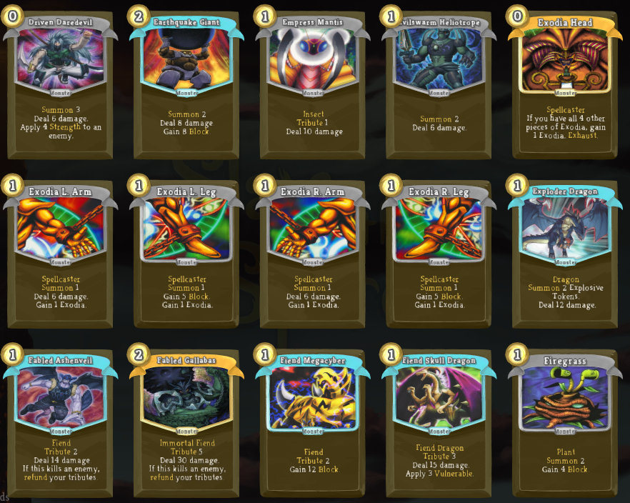
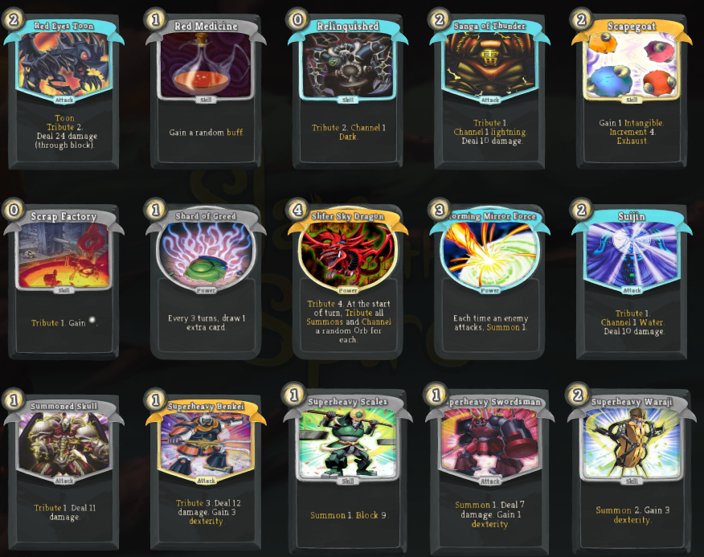
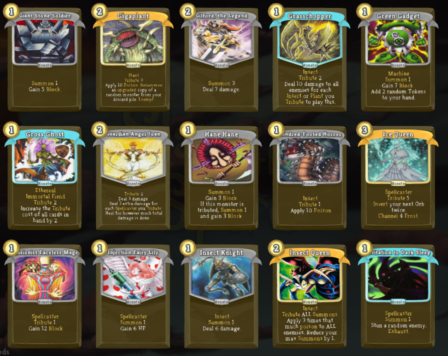
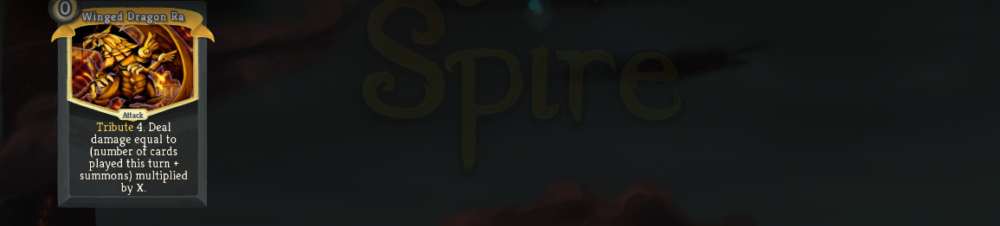

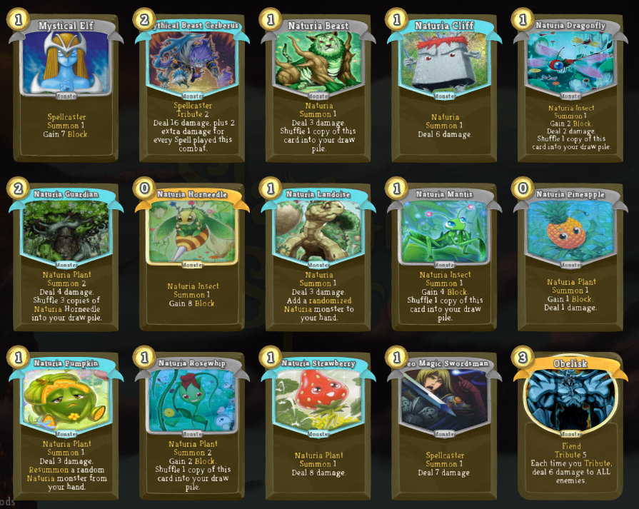
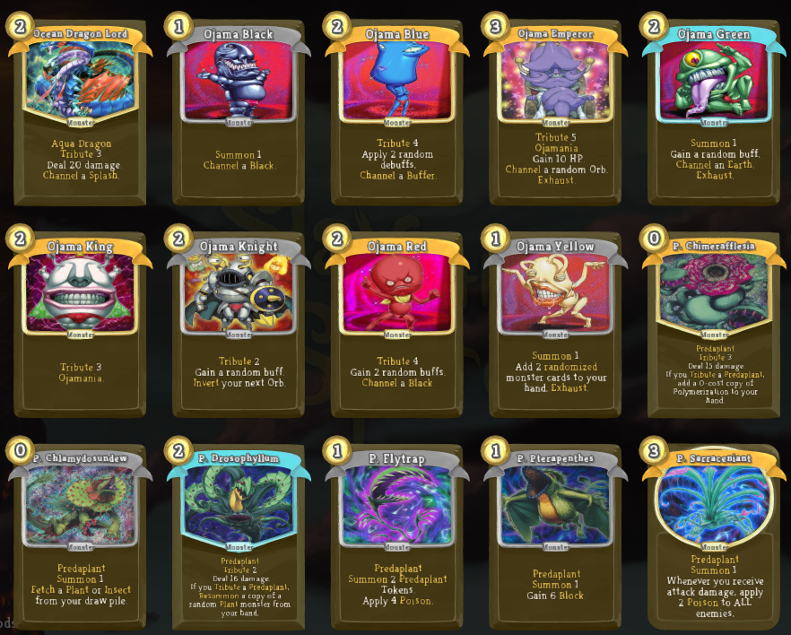
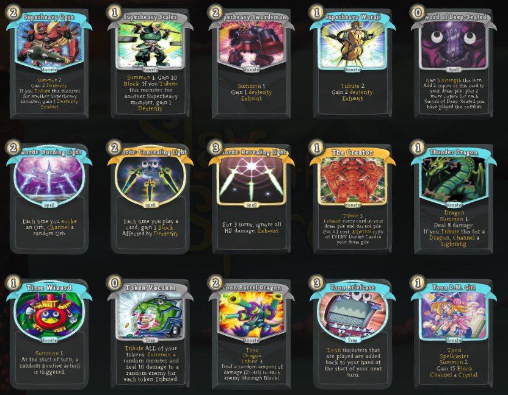
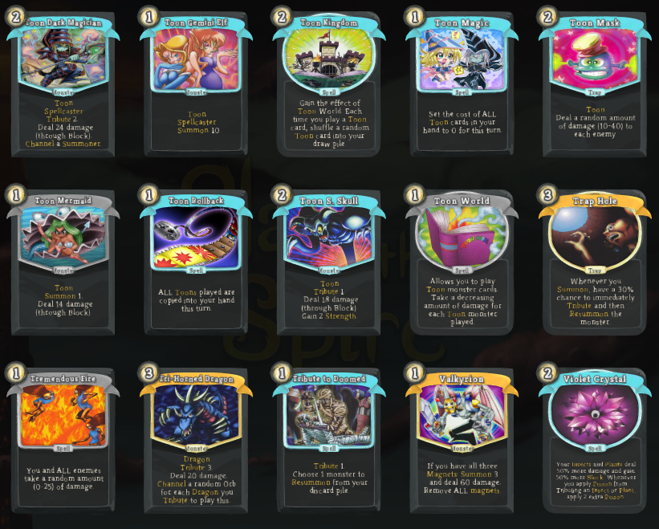
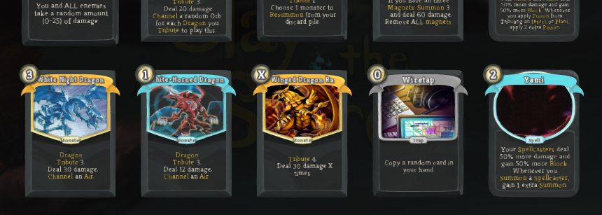
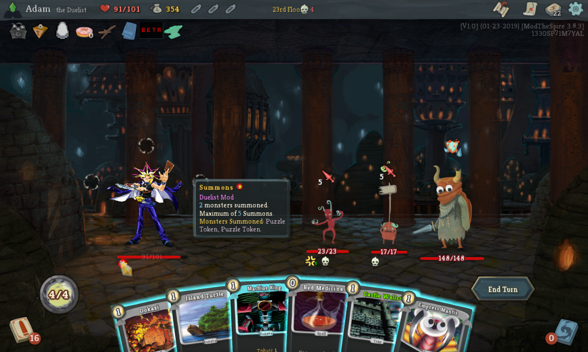
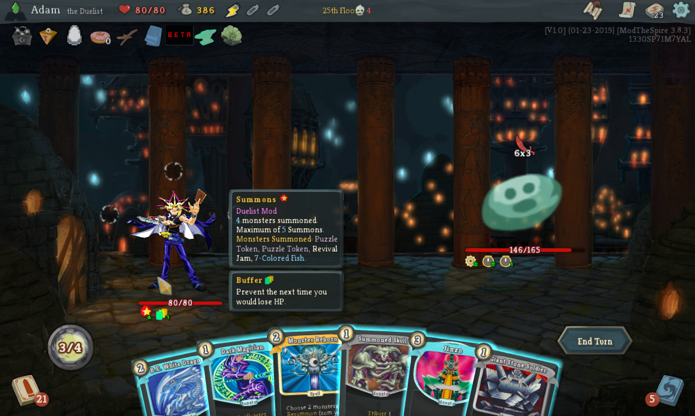